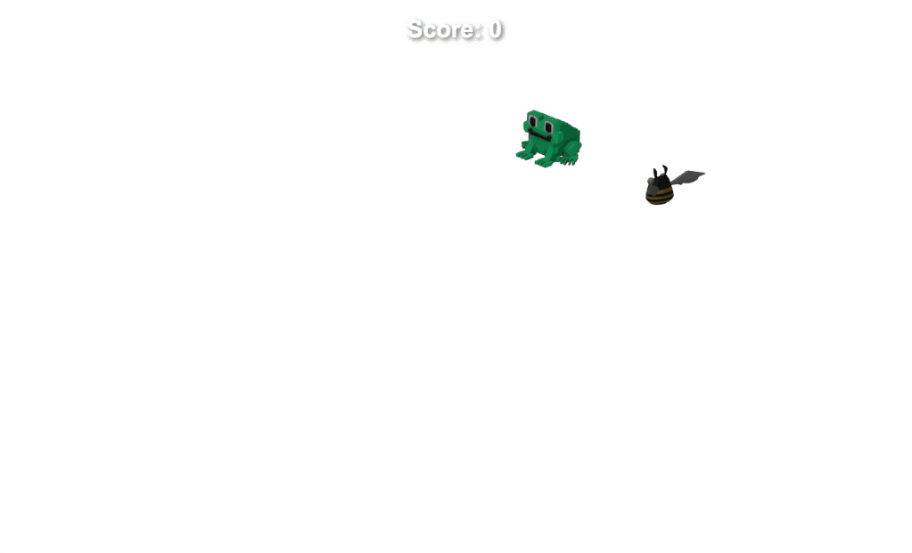

The ultimate reward in many games is the score. Think about how often you've heard someone boast about beating their friends' high scores! Let’s bring that competitive spirit to our game. To make the score feel earned, the points should be proportional to the player's effort. We’ll reward both survival time and the number of enemies defeated.

We've prepared the agent prompt with the technical details to implement this scoring system.

Here is what we need to focus on:
### Scoring logic
The score should reflect two different types of achievement — but they aren't weighted equally. Surviving is important, but simply running away from danger is relatively easy. Defeating enemies requires more effort and risk. Because this is harder, it should be rewarded more.

Let’s set the rules:
- **Survival reward** will add 1 point for every 10 seconds the player stays alive.
- **Kill reward** will add 10 points for each enemy defeated.

Track survival time and continuously update the score during the game.
### Score UI
Rules are great, but the player needs to see their progress! We'll add a small score display at the top of the screen that remains visible during gameplay. The display should update the moment a point is earned so the player gets instant feedback. We'll ensure the number is always rounded down to the nearest whole value.

### Customize the difficulty
Game balance often comes down to just a few simple numbers. To make scoring easy to adjust, let’s store these rewards as constants from the start.

Define two constants: `SCORE_PER_SECOND=0.1` (which equals 1 point per 10 seconds) and `SCORE_PER_KILL=10`. This allows you to balance the game later without touching the core logic. If the game feels too slow or the difficulty spikes too fast, just tweak these values and see how the "rhythm" of the gameplay shifts.

### Putting it all together
Use the specification in the `spec.md` file to implement the scoring system. This will handle the time-based calculations, the kill bonuses, and the UI updates.

Feel free to experiment with the code manually or ask a coding agent for suggestions to further polish the score display. Your results should look like this:

