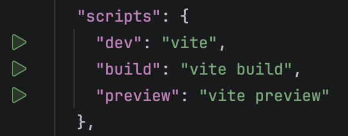

### What’s inside the project

You’ll build and edit everything right here in the IDE. You're starting with an empty project — a blank canvas where your game world will grow step by step. 
We’ll use [Three.js](https://threejs.org/) to create the 3D scene.

### Task specification
We won’t overload you with technical details. Each lesson is split into a task description (what you are reading now) and prompt ideas on how to solve it. 
Take a look at the open `spec.md` file. It’s a short document describing exactly what we expect in this task. You can use it as-is or tweak it to fit your own preferences!

### Files to know
You’ll see `AGENTS.md` — it contains general instructions for the AI coding agent and key points to keep in mind.

In `game/package.json`, you’ll find the mission control for your project: it manages the setup, tooling, and required dependencies (libraries/modules). 
The most important part right now is `scripts`: this is where we define commands to run the app, run tests, or install dependencies in new modules.

### Let’s run your project for the first time!
To launch the game, open `game/package.json` and click the  icon next to the `dev` script in the IDE interface.

  

Alternatively, you can use the terminal: navigate to the <code>game</code> folder with the <code>cd game</code> command, and then start it with <code>npm run dev</code>.

You should see an output similar to this:

  

Click the URL provided in the terminal to open it in your browser. You'll see a blank screen for now, but soon that empty world will become Tode’s battlefield!

### Stopping the project
Remember to always stop your application when you're finished. Click the  button in the tool window at the bottom of your IDE or press `^C` (Ctrl+C).

**Time to begin our adventure!**

