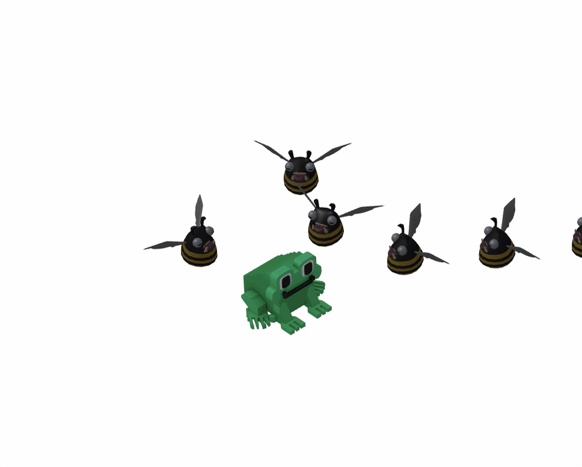

It's time to stop running and start fighting back! Now that enemies are chasing you and respecting your physical space, 
Tode needs a way to clear the path. In this task, we'll implement a player attack mechanism.

We've prepared the agent prompt with the technical specifications for the combat logic.

Here is what we’ll be focusing on:

### Triggering the attack
We’ll use the **Space** key to trigger our hero's power. However, to keep the game balanced, 
we can't let the player spam attacks indefinitely. 
We will implement a cooldown – a short delay (starting at 1 second) during which the player cannot attack again.

### Visualizing the area of effect
The player needs to know exactly where their attack hits. We will create a yellow circle around Tode
that appears briefly when you strike. This provides immediate visual feedback that your command was registered.

### Combat Logic: who gets hit?
When the attack is triggered, the hame needs to perform a "radius check":
- The radius: we'll define a constant distance representing the reach of the attack.
- The check: we look at all active enemies and calculate their distance from the player.
- The result: if an enemy is inside the attack circle, they are removed from the scene and the tracking list. Poof! Gone!

### Animation loop integration
Just like movement and spawning, the attack cooldown needs to be tracked in the animation loop.
With every frame, the code will decrease the remaining cooldown time until it reaches zero, allowing the hero to strike once more.

### Putting it all together
Use the specification in the `spec.md` file to build the attack system. 
It will handle the keyboard input for the Space key and implement the logic to clean up "defeated" enemies from your arrays and the scene.

By the end of this task, you’ll be able to clear out those pesky enemies with a well-timed blast:

The feel of an attack depends entirely on the balance between risk and reward. Try playing with these values to see how they change the game:
- Attack radius: does Tode have a precise, short-range strike or a massive shockwave?
- Cooldown time: how often can the player use their power?
- Visuals: you could even try changing the color or adding a "fade-out" animation to the circle to make it look more polished.
