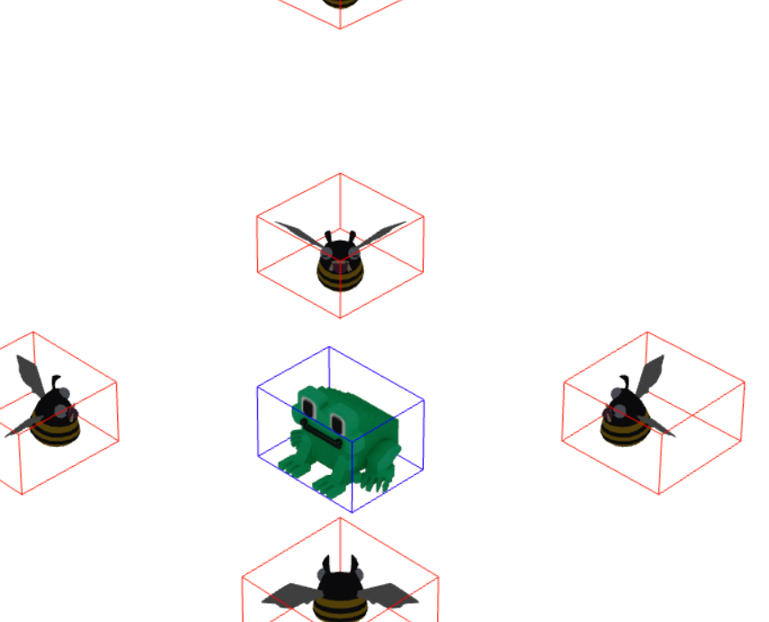

Our hero is moving, and the enemies are in hot pursuit! 
However, you might have noticed something strange: everyone is "ghosting" through each other. 
In this task, we will ground our game in reality by implementing collision detection.

We've prepared the agent prompt with technical details needed to handle these physical interactions.

Here are the key concepts for this step:

### Defining boundaries
In a 3D world, "touching" isn't as simple as it looks. While Three.js offers a standard `Box3` (a rectangular bounding box), 
these can feel too "boxy" for rounded characters, leading to frustrating "invisible wall" moments.

Instead, we’ll use the actual geometry of the models to determine where their physical presence begins and ends.

### Collision rules
We need to enforce some basic laws of physics for our characters:
- Enemy vs. Enemy: Enemies should respect each other's personal space! They shouldn't be able to occupy the same spot on the map.
- Enemy vs. Player: Our hero shouldn't be able to walk through an enemy, and an enemy shouldn't be able to phase through our hero.

### Integration in the loop
The best time to check for collisions is during the update phase of our animation loop.
1. Calculate the intended next position for the player or enemy.
2. Run a check against all other relevant objects in the scene.
3. If the path is clear, the character moves. If an obstacle is in the way, they stay put.

### Tuning the "hitbox"
Because 3D models come in many shapes, defining the perfect boundary can be complex. 
To give you fine-grained control without the headache, we'll use a collision distance constant.
This allows you to decide exactly how close characters can get before they "hit" each other.

### Putting it all together
Use the specification in the `spec.md` file to implement the collision logic. 
It will help you implement the distance-checking logic and integrate it into the existing movement systems for both Tode and the monsters.

Once implemented, your game world will feel much more tangible: no more overlapping enemies or walking through monsters!

Try adjusting the collision distance manually – or ask the agent for help – to explore your customization options
and refine the game feel exactly the way you want it.
