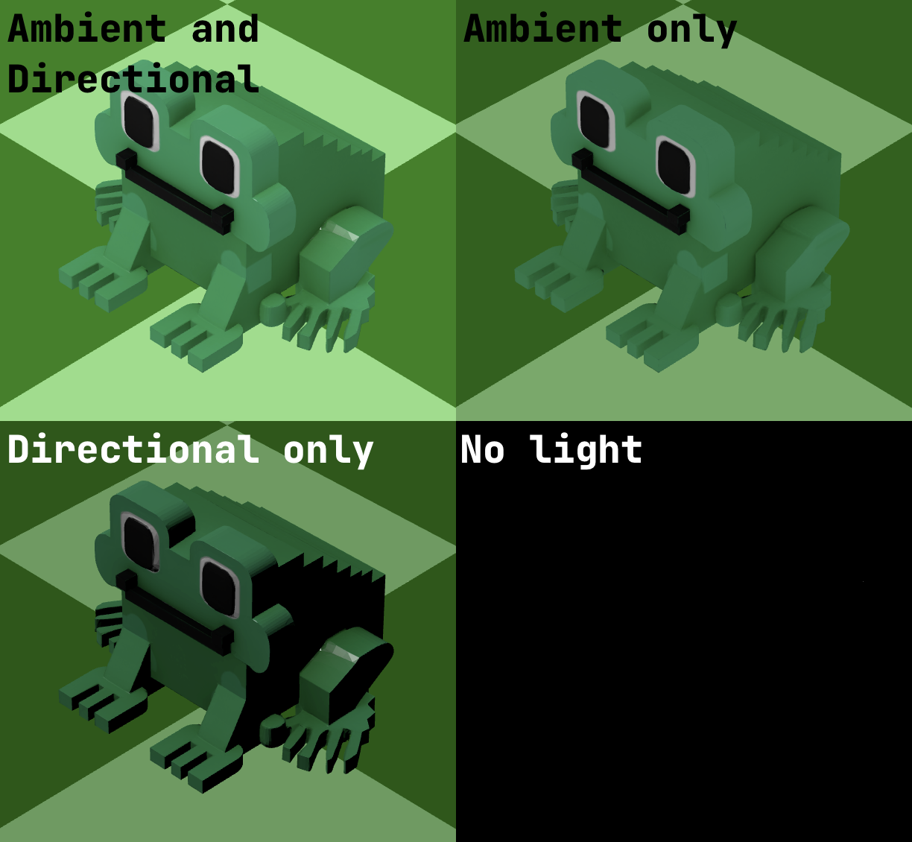
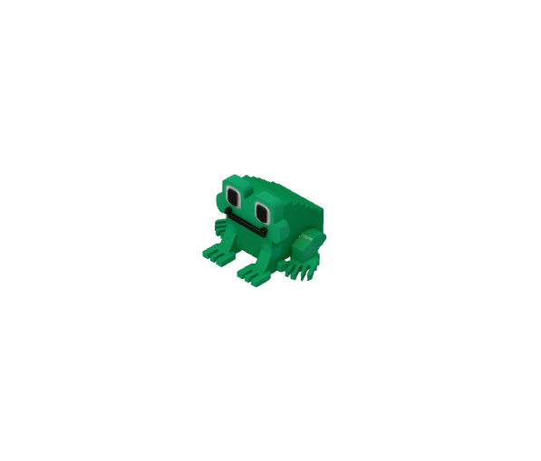

It's time to take our first major step: creating a scene and placing the very first object we can see.

To help you get started, we have added the technical details to the agent prompt. 

Here is what we need to focus on:

### Scene
There's nothing complex here – the Three.js library provides a ready-made constructor for the scene. Think of it as a physical stage where all other objects, lights, and cameras will be placed.

### Lights
For good visual results, we need at least two light sources:
- **Ambient light**: Provides consistent base illumination.
- **Directional light**: Mimics sunlight to create shadows and highlights, making objects feel truly three-dimensional.
  
Take a look at the effect of these two light sources in this example:

### Player model
Next, let's create our hero. We’ll organize our project by creating a `Player` file inside the `game/src/components` directory.
We will use the `tode.glb` 3D model located in the `game/public/models` directory as the character model. 
Of course, feel free to find or create your own custom model for the main character later!

Note that some models may appear rotated (for example, lying on their side) after loading. You can fix this by adjusting the rotation manually.
You’ll need to tweak the rotation axis and angle (for example, `frog.rotation.x = Math.PI / 2`).
Don't hesitate to ask the coding agent to handle these offsets for you until it looks correct.

### Camera
To see our hero, we need to add a camera to the scene.
There are two primary types: **Orthographic Camera** and **Perspective Camera**.
A perspective camera mimics human vision, making distant objects appear smaller as lines converge in the distance. 
In contrast, an Orthographic camera renders objects at their true size regardless of distance, keeping parallel lines parallel.

To make our game feel more realistic, we'll use a perspective camera. 
We've suggested some starting parameters in the prompt, 
but feel free to experiment with the values and the camera's position to find the perfect view.  

### Rendering
The final step is to visualize our scene. This is where the renderer comes in.
The renderer takes your scene and your camera and converts all that 3D data into the pixels you see in your browser window.

### Putting it all together
Use the requirements in the `spec.md` file to create your scene with the player and camera.
You can use the suggested settings as they are or tune the parameters until the scene looks exactly how you want it.

By the end of this stage, you should see our hero in the center of your browser against a clean background:

### Where to get models?
We have prepared several models for you to use in this course, but don't limit yourself to just these!
- You can always find free models on resources like [poly.pizza](https://poly.pizza/) or [Sketchfab](https://sketchfab.com/).
- You can generate 3D assets using AI models like [Nano Banana](https://openrouter.ai/google/gemini-3-pro-image-preview).
- You can create your own unique models from scratch using professional software like [Blender](https://www.blender.org/).
